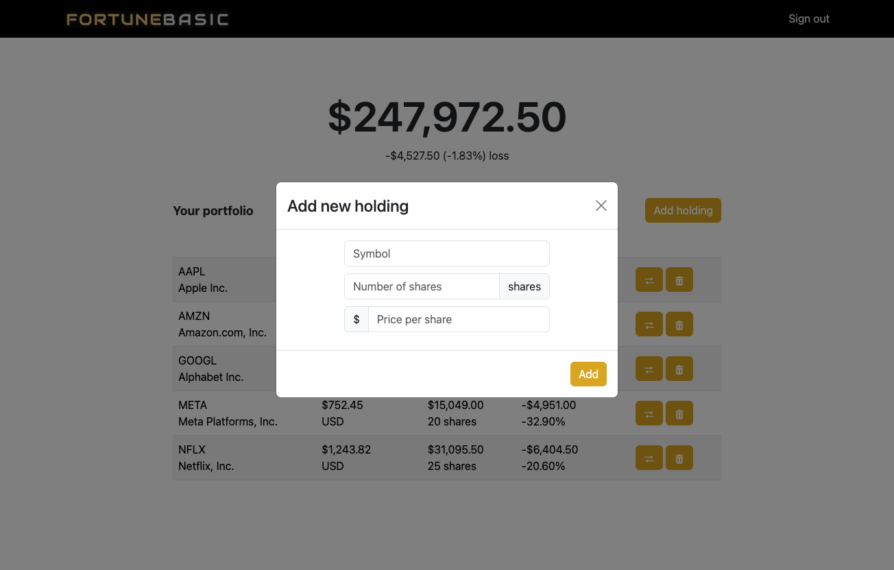

# Investment Portfolio Dashboard

**Author:** Aron Saengchan

## Summary

A web application designed using React, Firebase (authentication and Firestore database), and Docker to help users keep track of their personal investments. The dashboard allows users to view the value of their individual and total investments in real-time, including the ability to add, update, and delete holdings in order to keep their portfolio up to date.

<table align="center">
  <tbody>
    <tr>
      <th>Sign In</th>
    </tr>
    <tr>
      <td></td>
    </tr>
  </tbody>
</table>

<table align="center">
  <tbody>
    <tr>
      <th>Dashboard</th>
    </tr>
    <tr>
      <td></td>
    </tr>
  </tbody>
</table>

<table align="center">
  <tbody>
    <tr>
      <th>Add Holdings</th>
    </tr>
    <tr>
      <td></td>
    </tr>
  </tbody>
</table>
